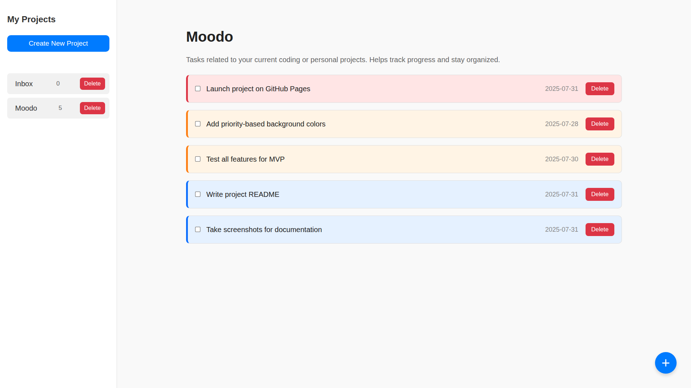
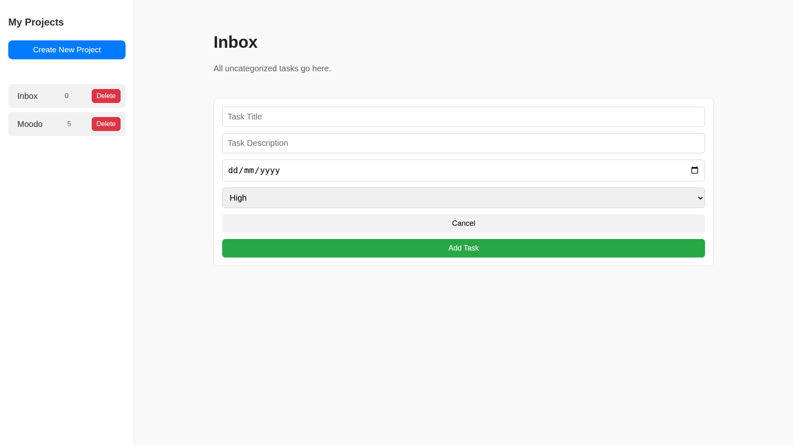
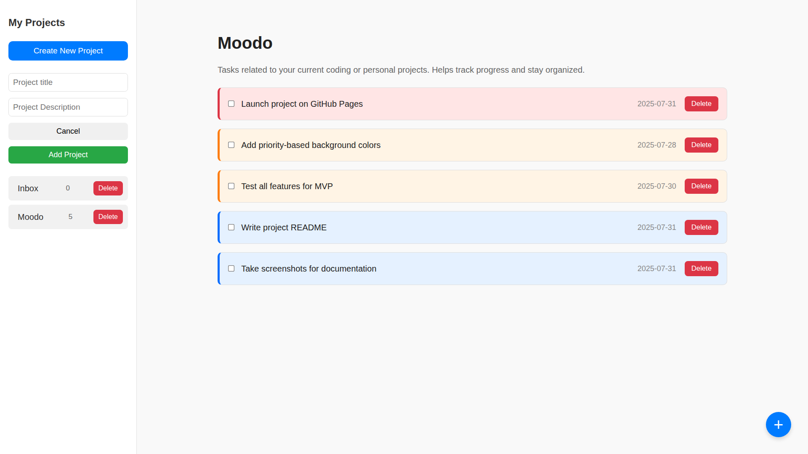

# Moodo

A sleek and functional ToDo List web application built as part of [The Odin Project](https://www.theodinproject.com/) JavaScript curriculum.

## 🔍 Overview

This project allows users to:

- Create, view, and manage multiple tasks
- Edit or delete existing tasks
- Organize tasks by project category
- View task details through a modal popup

It demonstrates core concepts of modern JavaScript development and modular design using Webpack.

## 🚀 Live Demo

👉 [View Live Project](https://your-username.github.io/todo-list/)  
_(Replace with your actual GitHub Pages link)_

## 🖼️ Screenshots

### 🧩 Task List View

### ➕ Add New Task Modal

### 🗂️ Projects Sidebar

## 🛠️ Skills Demonstrated

- JavaScript modules and ES6 syntax
- DOM manipulation
- Event handling
- Webpack for bundling and asset management
- Git & GitHub workflow
- GitHub Pages deployment
- Basic UI/UX layout using HTML and CSS

## 📁 Project Structure

- `src/`: All modular JavaScript files
- `dist/`: Bundled production files generated by Webpack
- `webpack.config.js`: Webpack setup for development and production

## 📌 Reflection

Through this project, I gained a solid understanding of:

- Structuring a JavaScript project using modules
- Building scalable and maintainable codebases
- Setting up Webpack and deploying to GitHub Pages
- Writing clean, interactive UI logic

---
